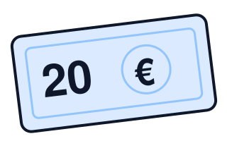
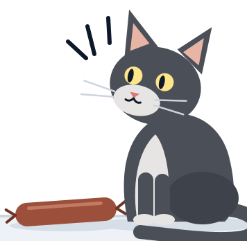

## €20 на тротоара {#s02}

::: {.cols-2 .wide-left .v-center}
::: {.dialogue}
[Студент:]{.who} „Вижте, 20 евро на тротоара!“

[Икономист:]{.who} „Невъзможно. Ако бяха истински, някой вече щеше да ги е взел“
:::

::: {}
{.euro-icon fig-alt="Стилизирана банкнота от 20 евро, паднала на земята."}
:::
:::

::: {.punch}
„Предприемачът е този, който ги взима“
:::

## Колко оцеляват? {#s03}

::: {.lead}
От 100 нови фирми в България колко са живи след пет години?
:::

## Седем въпроса от мястото на предприемача {#s04}

::: {.lecture-path}
:::

## {.divider block="1"}

## Три идеи за предприемачестввото {#s05}

::: {.cols-3 .cards}
::: {.card .entrant}
{.icon fig-alt="Икона: два кръга, които се застъпват — нова комбинация."}

### Шумпетер · иноваторът

Нови комбинации, които изместват старите („creative destruction“).
:::

::: {.card .entrant}
{.icon fig-alt="Котката от първия слайд, този път с отворени очи, гледа наденицата."}

### Кирцнер · откривателят

Вижда възможности, които другите пропускат.
:::

::: {.card .entrant}
{.icon fig-alt="Икона: зар с въпросителен знак — несигурност."}

### Найт · носителят на несигурност

Печалбата е награда за риск, който не може да се застрахова.
:::
:::

::: {.source}
Baumol, Litan & Schramm (2007): предприемач е всеки, нов или съществуващ, който предлага нов продукт или услуга или въвежда по-евтин начин да произвежда и доставя съществуващите.
:::

## Какъв тип е всеки? {#s06}

::: {.cols-2 .wide-left}
::: {.people}
1. Шофьор в Bolt вечер след работа
2. Служител в банка, който създава нов продукт
3. Франчайз на верига кафенета
4. Основател на стартъп
:::

::: {.contrasts}
- [по възможност]{.a} [/]{.sep} [по необходимост]{.b}
- [предприемач]{.a} [/]{.sep} [предприемач в организацията]{.b}
- [иновация]{.a} [/]{.sep} [копиране]{.b}
:::
:::

## {.divider block="2"}

## Три вида предприемачество {#s07}

::: {.types-table}
| Вид | Какво прави | Пример |
|---|---|---|
| [+]{.pp-mark .plus} Продуктивно | създава стойност | нов продукт, по-евтин процес |
| [=]{.pp-mark .same} Непродуктивно | преразпределя стойност | лобиране, заобикаляне на правила |
| [−]{.pp-mark .minus} Разрушително | унищожава стойност, може да е незаконно | неморално, непродуктивно |
:::

::: {.punch}
„Талантът е общо взето константен. Правилата решават къде отива.“
:::

::: {.source}
Baumol (1990).
:::

## Имперски Китай {#s08}

::: {.cols-2 .china}
::: {}
::: {.lead}
В имперски Китай най-способните не отиват в бизнеса, а на изпитите за държавни чиновници.
:::

::: {.ask}
Къде отиват най-способните у нас днес?
:::
:::

::: {.figure-frame}
{fig-alt="Картина на Цю Ин от около 1540 г.: тълпа кандидати в халати под навес пред стената, на която са закачени резултатите от имперските изпити; отпред чакат коне и слуги."}
:::
:::

## Продуктивно, непродуктивно или разрушително? {#s09}

::: {.poll-line}
Помислете за всеки случай: **П** — продуктивно · **Н** — непродуктивно · **Р** — разрушително
:::

::: {.case-grid}
::: {.case}
[1]{.case-n} Софтуерна компания, създадена в София и продадена на глобален инвеститор (Telerik)
:::
::: {.case}
[2]{.case-n} Фирма, която печели почти всяка обществена поръчка в своята община
:::
::: {.case}
[3]{.case-n} Консултант, който „оптимизира“ проекти по европейски програми
:::
::: {.case}
[4]{.case-n} Телефонни измамници, които звънят на пенсионери
:::
::: {.case}
[5]{.case-n} Браншова организация, която лобира за нов лиценз за дейността
:::
::: {.case}
[6]{.case-n} Данъчен консултант, който помага на фирми законно да плащат по-малко данъци
:::
::: {.case}
[7]{.case-n} Приложение, което сравнява цените в супермаркетите
:::
::: {.case}
[8]{.case-n} Фирма, която купува патенти само за да съди производители
:::
:::

## {.divider block="3"}


## Колко оцеляват? {#s14}

::: {.cols-2 .survival}
::: {}
```{ojs}
viewof guessText = Inputs.text({ label: "Вашата прогноза, %", placeholder: "медианата на класа", width: 140 })
guess = { const v = parseFloat(String(guessText).replace(",", ".")); return v >= 0 && v <= 100 ? v : NaN; }
```

```{ojs}
survival = {
  const rows = bd.filter((d) => d.indicator === "survival_5y");
  const years = d3.intersection(...["BG", "EU27_2020"].map((g) => rows.filter((d) => d.geo === g).map((d) => d.year)));
  const year = d3.max(years);
  const pick = rows.filter((d) => d.year === year)
    .map((d) => ({ ...d, label: d.geo === "BG" ? "България" : "ЕС-27" }))
    .sort((a, b) => (a.geo === "BG" ? -1 : 1));
  return { year, rows: pick, dataset: pick[0]?.dataset };
}
```

```{ojs}
Plot.plot({
  width: phone ? 350 : 540,
  height: phone ? 190 : 270,
  marginLeft: phone ? 76 : 104,
  marginRight: phone ? 44 : 56,
  marginTop: 40,
  marginBottom: 44,
  style: { fontFamily: font, fontSize: phone ? "12px" : "17px", color: C.ink },
  ariaLabel: "Петгодишна преживяемост на новите фирми",
  ariaDescription: `През ${survival.year} г. след пет години са живи ${survival.rows.map((d) => `${d.label}: ${pct(d.value / 100)}`).join("; ")}.`,
  x: { domain: [0, 100], ticks: [0, 25, 50, 75, 100], tickFormat: (d) => `${d}%`, label: "живи след 5 години →" },
  y: { label: null, domain: survival.rows.map((d) => d.label), tickSize: 0 },
  marks: [
    Plot.barX(survival.rows, { x: "value", y: "label", fill: (d) => (d.geo === "BG" ? C.market : C.marketLight), insetTop: 8, insetBottom: 8 }),
    Plot.text(survival.rows, { x: "value", y: "label", text: (d) => pct(d.value / 100), dx: 8, textAnchor: "start", fontWeight: 600, fontSize: phone ? 13 : 19, fill: C.ink }),
    Plot.ruleX([0], { stroke: C.ink }),
    Number.isFinite(guess) ? Plot.ruleX([guess], { stroke: C.ink, strokeWidth: 2.5, strokeDasharray: "7 5" }) : null,
    Number.isFinite(guess) ? Plot.text([guess], { x: (d) => d, frameAnchor: "top", dy: -24, text: (d) => `Вашата прогноза: ${num(d)}%`, fontWeight: 600, fontSize: phone ? 12 : 17, fill: C.ink }) : null,
  ],
})
```

```{ojs}
html`<p class="source">Източник: Eurostat, ${survival.dataset}, ${survival.year} г.; бизнес икономика, всички класове по размер.</p>`
```
:::

::: {.fragment .churn-panel}
```{ojs}
Plot.plot({
  width: phone ? 350 : 500,
  height: phone ? 210 : 300,
  marginLeft: 44,
  marginRight: phone ? 76 : 100,
  marginTop: 42,
  style: { fontFamily: font, fontSize: phone ? "11px" : "15px", color: C.ink },
  ariaLabel: "Раждания плюс закривания на фирми, България и ЕС-27",
  ariaDescription: "Сборът на дела на новите и на закритите фирми, в процент от активните, по години. Редът прекъсва между 2020 и 2021 г., защото Евростат сменя методологията.",
  x: { label: null, tickFormat: (d) => String(d), ticks: [2010, 2015, 2020, 2024] },
  y: { domain: [0, 30], label: "↑ раждания + закривания, % от активните", grid: true },
  marks: [
    Plot.ruleX([2020.5], { stroke: C.muted, strokeDasharray: "4 4" }),
    Plot.text([2020.5], { x: (d) => d, frameAnchor: "top", dy: -14, text: () => "нова методология →", textAnchor: "start", dx: -4, fill: C.muted, fontSize: phone ? 10 : 13 }),
    Plot.line(churn, { x: "year", y: "value", z: (d) => d.geo + d.series, stroke: (d) => (d.geo === "BG" ? C.market : C.marketLight), strokeWidth: 2.5 }),
    Plot.dot(churn, { x: "year", y: "value", fill: (d) => (d.geo === "BG" ? C.market : C.marketLight), r: 3 }),
    Plot.text(churnEnds, { x: "year", y: "value", text: "label", dx: 8, textAnchor: "start", fill: (d) => (d.geo === "BG" ? C.market : C.muted), fontWeight: 600 }),
  ],
})
```

```{ojs}
//| output: false
churn = bd.filter((d) => d.indicator === "churn" && d.year >= 2008)
churnEnds = ["BG", "EU27_2020"].map((g) => {
  const last = d3.greatest(churn.filter((d) => d.geo === g), (d) => d.year);
  return { ...last, label: g === "BG" ? "България" : "ЕС-27" };
})
bd = FileAttachment("data/eurostat_bd.csv").csv({ typed: true })
```
:::
:::

```{ojs}
//| output: false
// Shared setup for the widgets on slides 14, 15, 20 and 29.
Plot = import("https://cdn.jsdelivr.net/npm/@observablehq/plot@0.6.17/+esm")
import { criticalLoss, profitChange, lossVerdict, entryOutcome, entrantAverageCost, flippersLeft, FLIPPERS } from "./lib/models.js"
import { pct, num, eur } from "./lib/format.js"
C = ({ entrant: "#0F766E", incumbent: "#B45309", market: "#475569", marketLight: "#94A3B8", profit: "#15803D", loss: "#B91C1C", ink: "#1a1a2e", muted: "#666666", line: "#d1d5db" })
phone = Generators.observe((notify) => {
  const update = () => notify(document.documentElement.classList.contains("phone"));
  update();
  window.addEventListener("decklayout", update);
  return () => window.removeEventListener("decklayout", update);
})
font = "Inter, Segoe UI, Helvetica Neue, Arial, sans-serif"
setInput = (input, value) => { input.value = value; input.dispatchEvent(new Event("input", { bubbles: true })); }
```

::: {.takeaway}
около 4 от 10 нови фирми в България оцеляват пет години — близо до средното за ЕС.
:::

## Струва ли си финансово? {#s15}

::: {.cols-2 .money}
::: {.money-points}
- „Медианният предприемач печели по-малко, отколкото би печелил като нает.“ [(Hamilton 2000)]{.cite}
- „Но печалбите са крайно неравни: малцина печелят много“
- „Оцелелите: 225 млн. души хвърлят монета. След 20 рунда около 215 са познали всеки път — и пишат книги за историята си.“ [(Buffett 1984)]{.cite}
:::

::: {}
```{=html}
<svg class="diagram skew" viewBox="20 20 540 270" role="img" aria-labelledby="skew-t skew-d">
  <title id="skew-t">Схематично разпределение на доходите на предприемачите</title>
  <desc id="skew-d">Схематична крива с дълга дясна опашка: повечето предприемачи са около медианата, която е под заплатата като нает, а малцина печелят огромно.</desc>
  <line x1="40" y1="250" x2="545" y2="250" stroke="var(--ink)" stroke-width="2"/>
  <text x="545" y="276" text-anchor="end" font-size="17" fill="var(--muted)">доход от собствения бизнес →</text>
  <path d="M40 250L42 250L43 247L45 240L47 229L48 214L50 198L52 181L53 165L55 149L57 134L58 120L60 108L62 97L63 88L65 80L67 73L68 67L70 62L72 58L73 55L75 53L77 51L78 50L80 50L82 50L83 51L85 52L87 53L88 54L90 56L92 58L93 60L95 63L97 65L98 68L100 70L102 73L103 76L105 79L107 82L108 85L110 88L112 90L113 93L115 96L117 99L118 102L120 105L122 108L123 111L125 113L127 116L128 119L130 121L132 124L133 127L135 129L137 132L138 134L140 137L148 148L157 158L165 167L173 175L182 183L190 189L198 195L207 200L215 205L223 209L232 213L240 216L248 219L257 222L265 224L273 226L282 228L290 230L298 231L307 233L315 234L323 235L332 237L340 238L348 238L357 239L365 240L373 241L382 241L390 242L398 243L407 243L415 244L423 244L432 244L440 245L448 245L457 245L465 246L473 246L482 246L490 246L498 247L507 247L515 247L523 247L532 247L540 247" fill="none" stroke="var(--entrant)" stroke-width="4" stroke-linejoin="round"/>
  <line x1="123" y1="111" x2="123" y2="250" stroke="var(--entrant)" stroke-width="2.5"/>
  <line x1="152" y1="60" x2="152" y2="250" stroke="var(--ink)" stroke-width="2.5" stroke-dasharray="7 5"/>
  <text x="116" y="42" text-anchor="end" font-size="17" font-weight="600" fill="var(--entrant)">медиана</text>
  <path d="M112 48L121 104" stroke="var(--entrant)" stroke-width="1.5"/>
  <text x="160" y="56" font-size="17" font-weight="600" fill="var(--ink)">заплата като нает</text>
  <text x="330" y="196" font-size="17" fill="var(--entrant)">малцина печелят огромно →</text>
  <text x="545" y="40" text-anchor="end" font-size="16" font-style="italic" fill="var(--muted)">схематично</text>
</svg>
```

::: {.flip-sim}
```{ojs}
viewof k = Inputs.range([0, 20], { step: 1, value: 0, label: "Рунд" })
```

```{ojs}
{
  const n = flippersLeft(k);
  const share = n / FLIPPERS;
  const caption = k === 20 ? "215 „гении“ с 20 поредни ези" : k === 0 ? "души хвърлят монета" : `още познават всеки път след ${k} ${k === 1 ? "рунд" : "рунда"}`;
  return html`<div class="flip" role="img" aria-label="${num(n)} ${caption}">
    <div class="flip-track"><div class="flip-bar" style="width:${Math.max(share * 100, 0.6)}%"></div></div>
    <p class="flip-n">${num(n)}</p>
    <p class="flip-cap">${caption}</p>
  </div>`;
}
```
:::
:::
:::

::: {.takeaway}
при достатъчно много играчи някой печели всеки път по чиста случайност — и после обяснява успеха си с метод.
:::

## Кой всъщност става предприемач? {#s16}

::: {.findings}
::: {.finding}
[Семейство]{.box-title}

Децата на предприемачи по-често стават предприемачи.
:::

::: {.finding}
[Капитал]{.box-title}

Наследство или печалба от лотария повишават шанса да се стартира нов бизнес.
:::

::: {.finding}
[Опит]{.box-title}

Повечето основатели започват в бранша, в който вече са работили.
:::

::: {.finding}
[„Умни и непослушни“]{.box-title}

Успешните основатели имат по-високи резултати на тестове за способности и повече нарушени правила като тийнейджъри.
:::
:::

## {.divider block="4"}

## Къде минава границата на пазара? {#s17}

::: {.subtitle-line}
Двете грешки на основателите: „целият пазар на храни е наш“ и „нямаме конкуренти“.
:::

::: {.cols-3 .cards .borders}
::: {.card .market}
[Физическа]{.box-title}

Докъде стига стоката.

[Електроенергия: пазарните зони и междусистемните връзки.]{.example}
:::

::: {.card .market}
[Регулаторна]{.box-title}

Какво казва законът.

[Лицензите за таксиметров превоз в София.]{.example}
:::

::: {.card .market}
[Икономическа]{.box-title}

Какво клиентът смята за заместител.
:::
:::

## Верига от заместители: такситата в София {#s18}

::: {.lead}
Кои от тях са на пазара на таксиметрови услуги в София?
:::

::: {.chain}
[TaxiMe]{.chain-item} [метро]{.chain-item} [тротинетка под наем]{.chain-item} [градски транспорт]{.chain-item} [собствен автомобил]{.chain-item}
:::

## Тест на хипотетичния монополист {#s19}

::: {.steps}
1. Започваме с най-тесния кандидат-пазар: капучиното в кафенетата около НБУ.
2. Представяме си един собственик на всички тях.
3. Може ли трайно да вдигне цената с 5–10% и да спечели?
4. **Не** → клиентите бягат към заместители → разшири пазара и повтори. **Да** → това е пазарът.
:::

## Колко клиенти можеш да се загубят? {#s20}

::: {.widget .critical-loss}
::: {.controls-col}
::: {.formula}
КЗ = *X* / (*X* + *M*)
:::

```{ojs}
viewof X = Inputs.range([1, 20], { step: 1, value: 10, label: "Повишение на цената X, %" })
```

```{ojs}
viewof M = Inputs.range([5, 80], { step: 5, value: 40, label: "Марж M, %" })
```

```{ojs}
viewof L = Inputs.range([0, 60], { step: 1, value: 15, label: "Очаквана загуба на клиенти L, %" })
```

```{ojs}
html`<div class="readout">
  <span class="k">Критична загуба (КЗ)</span><span class="v" id="cl-value">${pct(cl)}</span>
  <span class="k">Промяна на печалбата</span><span class="v ${dProfit >= 0 ? "pos" : "neg"}" id="cl-profit">${pct(dProfit, { max: 2, sign: true })}</span>
</div>`
```
:::

::: {.chart-col}
```{ojs}
html`<p class="price-line">Капучино в кафене до НБУ: <strong>${eur(3)}</strong> → <strong id="cl-price">${eur(3 * (1 + X / 100))}</strong></p>`
```

```{ojs}
{
  const good = clState === "profit";
  const fill = good ? C.profit : C.loss;
  const chart = Plot.plot({
    width: phone ? 350 : 520,
    height: phone ? 140 : 200,
    marginLeft: 16,
    marginRight: 28,
    marginTop: 52,
    marginBottom: 52,
    style: { fontFamily: font, fontSize: phone ? "12px" : "18px", color: C.ink },
    ariaLabel: "Очаквана загуба на клиенти спрямо критичната загуба",
    ariaDescription: `Очаквана загуба ${pct(L / 100, { min: 0, max: 0 })}, критична загуба ${pct(cl)}: ${clText}.`,
    x: { domain: [0, 0.6], ticks: [0, 0.1, 0.2, 0.3, 0.4, 0.5, 0.6], tickFormat: (d) => pct(d, { min: 0, max: 0 }), label: "клиенти, които си тръгват →" },
    y: { axis: null, domain: ["L"] },
    marks: [
      Plot.barX([L / 100], { x: (d) => d, y: () => "L", fill, insetTop: 6, insetBottom: 6 }),
      Plot.ruleX([cl], { stroke: C.ink, strokeWidth: 3 }),
      Plot.text([cl], { x: (d) => d, frameAnchor: "top", dy: -30, text: (d) => `КЗ = ${pct(d)}`, fontWeight: 600, fontSize: phone ? 13 : 17, fill: C.ink }),
      Plot.ruleX([0], { stroke: C.ink }),
    ],
  });
  return html`<div class="cl-row">${chart}<p class="verdict ${clState}" id="cl-verdict">${clText}</p></div>`;
}
```

```{ojs}
//| output: false
cl = criticalLoss(X / 100, M / 100)
dProfit = profitChange(X / 100, M / 100, L / 100)
clState = lossVerdict(L / 100, cl)
clText = ({ profit: "Повишението е изгодно", loss: "Неизгодно: клиентите имат заместители, пазарът е по-широк", edge: "На ръба" })[clState]
```
:::
:::

::: {.takeaway}
колкото по-голяма е разликата между приходи и разходи, толкова по-малко клиенти можеш да си позволиш да загубиш.
:::

## Каква е цената на безплатното? {#s21}

::: {.cols-2 .wide-left .free}
::: {}
- FTC срещу Meta (ноември 2025): FTC твърди, че пазарът е само Facebook, Instagram, Snapchat и MeWe. Съдът добавя TikTok и YouTube — и Meta не е монополист.
- При безплатен продукт „цената“ е качеството: повече реклами, по-малко поверителност. Потребителите плащат с време.
- Естествен експеримент: Индия забранява TikTok (2020) и времето във Facebook расте с над 60%, а в Instagram почти се удвоява.
:::

::: {.market-box}
::: {.mb-outer}
[според съда]{.mb-label}

::: {.mb-inner}
[според FTC]{.mb-label}

[Facebook]{.mb-chip .meta} [Instagram]{.mb-chip .meta} [Snapchat]{.mb-chip} [MeWe]{.mb-chip}
:::

[TikTok]{.mb-chip} [YouTube]{.mb-chip}
:::

[[■]{.meta-key} приложения на Meta (заварен играч)]{.mb-legend}
:::
:::

::: {.ask}
Ако Instagram удвои рекламите, къде отиваш?
:::


## Бариери за навлизане {#s23}

::: {.tf}
[Вярно или невярно?]{.tf-q} „Български пощи“ има законов монопол. [Невярно.]{.fragment .tf-answer}
:::

::: {.fragment .barriers}
| Бариера | Пример |
|---|---|
| Икономии от мащаба | електропреносната мрежа (естествен монопол) |
| Невъзвратими разходи | рафинерия, телекомуникационна мрежа |
| Мрежови ефекти | Viber — там са всички |
| Регулация и лицензи | такситата; лобито от [слайд 9](#/s09) |
| Контрол върху ключов ресурс | рафинерия, пристанищен терминал |
:::

## Лукойл: доминиращ, но не естествен монопол {#s24}

- КЗК: „Лукойл-България“ е лидер в търговията на едро с автомобилни горива с дял между 40% и 60%.
- Октомври 2025: санкции на САЩ. 14 ноември 2025: правителството назначава особен търговски управител.

::: {.ask}
Ако собственикът трябва да излезе, по-лесно ли е навлизането? Къде са тесните места?
:::

::: {.fuel-chain}
```{=html}
<svg class="diagram fuel only-wide" viewBox="0 0 1134 214" role="img" aria-labelledby="fuel-t fuel-d">
<title id="fuel-t">Веригата на горивата в България</title>
<desc id="fuel-d">Основният път: внос на суров петрол, пристанищен терминал, рафинерия, складове, търговия на едро, бензиностанции. Паралелен път: внос на готови горива директно към складовете. Тесни места: терминалът, рафинерията и складовете.</desc>
<defs><marker id="fuel-arrow" viewBox="0 0 10 10" refX="8" refY="5" markerWidth="7" markerHeight="7" orient="auto-start-reverse"><path d="M0 0L10 5L0 10z" fill="var(--ink)"/></marker></defs>
<rect x="4" y="112" width="160" height="64" rx="10" fill="#fff" stroke="var(--market)" stroke-width="2"/><text x="84" y="140" text-anchor="middle" font-size="19" fill="var(--ink)">внос на</text><text x="84" y="162" text-anchor="middle" font-size="19" fill="var(--ink)">суров петрол</text>
<path d="M167 144H192" stroke="var(--ink)" stroke-width="2.5" marker-end="url(#fuel-arrow)"/>
<rect x="197" y="112" width="160" height="64" rx="10" fill="#fff" stroke="var(--incumbent)" stroke-width="3.5"/><text x="277" y="140" text-anchor="middle" font-size="19" fill="var(--ink)">пристанищен</text><text x="277" y="162" text-anchor="middle" font-size="19" fill="var(--ink)">терминал</text><text x="277" y="200" text-anchor="middle" font-size="16" font-weight="600" fill="var(--incumbent)">тясно място</text>
<path d="M360 144H385" stroke="var(--ink)" stroke-width="2.5" marker-end="url(#fuel-arrow)"/>
<rect x="390" y="112" width="160" height="64" rx="10" fill="#fff" stroke="var(--incumbent)" stroke-width="3.5"/><text x="470" y="151" text-anchor="middle" font-size="19" fill="var(--ink)">рафинерия</text><text x="470" y="200" text-anchor="middle" font-size="16" font-weight="600" fill="var(--incumbent)">тясно място</text>
<path d="M553 144H578" stroke="var(--ink)" stroke-width="2.5" marker-end="url(#fuel-arrow)"/>
<rect x="583" y="112" width="160" height="64" rx="10" fill="#fff" stroke="var(--incumbent)" stroke-width="3.5"/><text x="663" y="151" text-anchor="middle" font-size="19" fill="var(--ink)">складове</text><text x="663" y="200" text-anchor="middle" font-size="16" font-weight="600" fill="var(--incumbent)">тясно място</text>
<path d="M746 144H771" stroke="var(--ink)" stroke-width="2.5" marker-end="url(#fuel-arrow)"/>
<rect x="776" y="112" width="160" height="64" rx="10" fill="#fff" stroke="var(--market)" stroke-width="2"/><text x="856" y="140" text-anchor="middle" font-size="19" fill="var(--ink)">търговия</text><text x="856" y="162" text-anchor="middle" font-size="19" fill="var(--ink)">на едро</text>
<path d="M939 144H964" stroke="var(--ink)" stroke-width="2.5" marker-end="url(#fuel-arrow)"/>
<rect x="969" y="112" width="160" height="64" rx="10" fill="#fff" stroke="var(--market)" stroke-width="2"/><text x="1049" y="151" text-anchor="middle" font-size="19" fill="var(--ink)">бензиностанции</text>
<rect x="197" y="10" width="353" height="52" rx="10" fill="var(--surface)" stroke="var(--market)" stroke-width="2" stroke-dasharray="7 5"/>
<text x="374" y="43" text-anchor="middle" font-size="19" fill="var(--ink)">внос на готови горива (паралелен път)</text>
<path d="M550 36H663V107" fill="none" stroke="var(--ink)" stroke-width="2.5" stroke-dasharray="7 5" marker-end="url(#fuel-arrow)"/>
</svg>
```
```{=html}
<svg class="diagram fuel only-phone" viewBox="0 0 360 540" role="img" aria-labelledby="fuelp-t">
<title id="fuelp-t">Веригата на горивата: от вноса на суров петрол до бензиностанциите; тесни места са терминалът, рафинерията и складовете.</title>
<defs><marker id="fuelp-arrow" viewBox="0 0 10 10" refX="8" refY="5" markerWidth="7" markerHeight="7" orient="auto-start-reverse"><path d="M0 0L10 5L0 10z" fill="var(--ink)"/></marker></defs>
<rect x="16" y="8" width="200" height="52" rx="9" fill="#fff" stroke="var(--market)" stroke-width="2"/>
<text x="116" y="40" text-anchor="middle" font-size="17" fill="var(--ink)">внос на суров петрол</text>
<path d="M116 63V89" stroke="var(--ink)" stroke-width="2.5" marker-end="url(#fuelp-arrow)"/>
<rect x="16" y="94" width="200" height="52" rx="9" fill="#fff" stroke="var(--incumbent)" stroke-width="3.5"/>
<text x="116" y="126" text-anchor="middle" font-size="17" fill="var(--ink)">пристанищен терминал</text>
<text x="226" y="126" font-size="15" font-weight="600" fill="var(--incumbent)">тясно място</text>
<path d="M116 149V175" stroke="var(--ink)" stroke-width="2.5" marker-end="url(#fuelp-arrow)"/>
<rect x="16" y="180" width="200" height="52" rx="9" fill="#fff" stroke="var(--incumbent)" stroke-width="3.5"/>
<text x="116" y="212" text-anchor="middle" font-size="17" fill="var(--ink)">рафинерия</text>
<text x="226" y="212" font-size="15" font-weight="600" fill="var(--incumbent)">тясно място</text>
<path d="M116 235V261" stroke="var(--ink)" stroke-width="2.5" marker-end="url(#fuelp-arrow)"/>
<rect x="16" y="266" width="200" height="52" rx="9" fill="#fff" stroke="var(--incumbent)" stroke-width="3.5"/>
<text x="116" y="298" text-anchor="middle" font-size="17" fill="var(--ink)">складове</text>
<text x="226" y="298" font-size="15" font-weight="600" fill="var(--incumbent)">тясно място</text>
<path d="M116 321V347" stroke="var(--ink)" stroke-width="2.5" marker-end="url(#fuelp-arrow)"/>
<rect x="16" y="352" width="200" height="52" rx="9" fill="#fff" stroke="var(--market)" stroke-width="2"/>
<text x="116" y="384" text-anchor="middle" font-size="17" fill="var(--ink)">търговия на едро</text>
<path d="M116 407V433" stroke="var(--ink)" stroke-width="2.5" marker-end="url(#fuelp-arrow)"/>
<rect x="16" y="438" width="200" height="52" rx="9" fill="#fff" stroke="var(--market)" stroke-width="2"/>
<text x="116" y="470" text-anchor="middle" font-size="17" fill="var(--ink)">бензиностанции</text>
<rect x="236" y="154" width="118" height="74" rx="9" fill="var(--surface)" stroke="var(--market)" stroke-width="2" stroke-dasharray="6 4"/>
<text x="295" y="178" text-anchor="middle" font-size="16" fill="var(--ink)">внос на</text>
<text x="295" y="198" text-anchor="middle" font-size="16" fill="var(--ink)">готови</text>
<text x="295" y="218" text-anchor="middle" font-size="16" fill="var(--ink)">горива</text>
<path d="M295 228V292H221" fill="none" stroke="var(--ink)" stroke-width="2.5" stroke-dasharray="6 4" marker-end="url(#fuelp-arrow)"/>
</svg>
```
:::

## Колко фирми стигат за конкуренция? {#s25}

::: {.lead}
Колко аптеки трябват на един малък град, за да паднат цените?
:::

::: {.options-row}
[1]{.opt} [2]{.opt} [3]{.opt} [5+]{.opt}
:::

::: {.fragment .pharmacies}
::: {.cols-2 .wide-right .v-center}
::: {.lead}
Повечето промяна идва с втората и третата фирма. Следващите променят малко.

[Bresnahan & Reiss (1991)]{.cite}
:::

```{=html}
<svg class="diagram" viewBox="20 20 560 290" role="img" aria-labelledby="ph-t ph-d">
  <title id="ph-t">Схематично: цени и брой аптеки</title>
  <desc id="ph-d">Схематична крива: цените падат силно с втората и третата аптека и почти не се променят с четвъртата и петата.</desc>
  <line x1="70" y1="250" x2="560" y2="250" stroke="var(--ink)" stroke-width="2"/>
  <line x1="70" y1="40" x2="70" y2="250" stroke="var(--ink)" stroke-width="2"/>
  <text x="80" y="46" font-size="17" fill="var(--muted)">↑ цени и надценки</text>
  <text x="560" y="300" text-anchor="end" font-size="17" fill="var(--muted)">брой аптеки в града →</text>
  <text x="560" y="46" text-anchor="end" font-size="16" font-style="italic" fill="var(--muted)">схематично</text>
  <rect x="190" y="68" width="210" height="182" fill="var(--market-tint)"/>
  <text x="295" y="236" text-anchor="middle" font-size="15" fill="var(--market)">повечето промяна</text>
  <polyline points="130,80 230,160 330,205 430,216 530,221" fill="none" stroke="var(--market)" stroke-width="4" stroke-linejoin="round"/>
  <g fill="var(--market)"><circle cx="130" cy="80" r="7"/><circle cx="230" cy="160" r="7"/><circle cx="330" cy="205" r="7"/><circle cx="430" cy="216" r="7"/><circle cx="530" cy="221" r="7"/></g>
  <g font-size="18" text-anchor="middle" fill="var(--ink)"><text x="130" y="276">1</text><text x="230" y="276">2</text><text x="330" y="276">3</text><text x="430" y="276">4</text><text x="530" y="276">5</text></g>
</svg>
```
:::
:::

## Играта на навлизане {#s26}

::: {.lead .poll-lead}
Вие сте заварен играч. Новият вече е влязъл. Борите ли се за запазване на пазарния дял или допускате навлизане на нов участник?
:::

::: {.tree-layout .fragment}
::: {.pan}
```{=html}
<svg class="diagram tree" viewBox="30 40 860 360" role="img" aria-labelledby="t26 d26">
  <title id="t26">Играта на навлизане</title>
  <desc id="d26">Предприемачът избира дали да влезе. Ако не влезе, печалбите са 0 за него и 10 за заварения. Ако влезе, завареният избира: борба дава −1 и 2, допускане дава 5 и 6. Първото число е за предприемача, второто — за заварения.</desc>
<g class="fragment prune" data-fragment-index="2"><line class="edge-line" x1="200" y1="200" x2="470" y2="80" stroke="var(--entrant)" stroke-width="3.5" stroke-linecap="round"/><text x="328" y="124" text-anchor="middle" font-size="21" fill="var(--entrant)" transform="rotate(-24.0 328 124)">не влиза</text><text x="486" y="88" font-size="25" font-weight="600" fill="var(--ink)">(<tspan fill="var(--entrant)">0</tspan>, <tspan fill="var(--incumbent)">10</tspan>)</text><circle cx="470" cy="80" r="5" fill="var(--ink)"/></g>
<g class="fragment" data-fragment-index="2"><path d="M270 154L281 179M281 149L292 174" stroke="var(--ink)" stroke-width="4" stroke-linecap="round"/></g>
<g class="fragment bold" data-fragment-index="2"><line class="edge-line" x1="200" y1="200" x2="470" y2="300" stroke="var(--entrant)" stroke-width="3.5" stroke-linecap="round"/></g><text x="325" y="278" text-anchor="middle" font-size="21" fill="var(--entrant)" transform="rotate(20.3 325 278)">влиза</text>
<g class="fragment prune" data-fragment-index="1"><line class="edge-line" x1="470" y1="300" x2="760" y2="230" stroke="var(--incumbent)" stroke-width="3.5" stroke-linecap="round"/><text x="611" y="248" text-anchor="middle" font-size="21" fill="var(--incumbent)" transform="rotate(-13.6 611 248)">бори се</text><text x="776" y="238" font-size="25" font-weight="600" fill="var(--ink)">(<tspan fill="var(--entrant)">−1</tspan>, <tspan fill="var(--incumbent)">2</tspan>)</text><circle cx="760" cy="230" r="5" fill="var(--ink)"/></g>
<g class="fragment" data-fragment-index="1"><path d="M548 267L554 294M560 264L566 291" stroke="var(--ink)" stroke-width="4" stroke-linecap="round"/></g>
<g class="fragment bold" data-fragment-index="1"><line class="edge-line" x1="470" y1="300" x2="760" y2="370" stroke="var(--incumbent)" stroke-width="3.5" stroke-linecap="round"/></g><text x="608" y="364" text-anchor="middle" font-size="21" fill="var(--incumbent)" transform="rotate(13.6 608 364)">допуска</text><text x="776" y="378" font-size="25" font-weight="600" fill="var(--ink)">(<tspan fill="var(--entrant)">5</tspan>, <tspan fill="var(--incumbent)">6</tspan>)</text><circle cx="760" cy="370" r="5" fill="var(--ink)"/>
<circle cx="200" cy="200" r="10" fill="var(--entrant)"/><text x="182" y="208" text-anchor="end" font-size="22" font-weight="600" fill="var(--entrant)">Предприемач</text>
<circle cx="470" cy="300" r="10" fill="var(--incumbent)"/><text x="470" y="342" text-anchor="middle" font-size="22" font-weight="600" fill="var(--incumbent)">Заварен</text>
</svg>
```
:::

::: {.tree-steps}
(печалби: [предприемач]{.role .entrant}, [заварен]{.role .incumbent})

::: {.tree-step .fragment fragment-index="1"}
**1.** Завареният сравнява 2 и 6 → допуска.
:::

::: {.tree-step .fragment fragment-index="2"}
**2.** Предприемачът сравнява 0 и 5 → влиза.
:::

::: {.punch .fragment fragment-index="3"}
„Заплахата не е достоверна.“
:::
:::
:::

## Doomsday device {#s27}

::: {.lead .small}
Преди новия играч завареният може да построи допълнителен капацитет на цена 3. Платен веднъж, той прави борбата евтина; ако стои неизползван, е чист разход.
:::

::: {.tree-layout .full-tree}
::: {.pan}
```{=html}
<svg class="diagram tree" viewBox="40 20 1000 505" role="img" aria-labelledby="t27 d27">
  <title id="t27">Играта с ангажимент: капацитет преди навлизането</title>
  <desc id="d27">Завареният първо избира дали да построи капацитет за 3. Без капацитет решението е като на предишния слайд: новият влиза, завареният допуска, печалби 5 и 6. С капацитет завареният печели 7, ако новият не влезе, 5, ако се бори, и 3, ако допусне; затова заплахата да се бори е достоверна, новият остава вън, а завареният строи и печели 7.</desc>
<g class="fragment prune" data-fragment-index="3"><line class="edge-line" x1="170" y1="250" x2="410" y2="130" stroke="var(--incumbent)" stroke-width="3.5" stroke-linecap="round"/><text x="282" y="174" text-anchor="middle" font-size="21" fill="var(--incumbent)" transform="rotate(-26.6 282 174)">без капацитет</text><g class="pre-pruned"><line class="edge-line" x1="410" y1="130" x2="640" y2="50" stroke="var(--entrant)" stroke-width="3.5" stroke-linecap="round"/><text x="519" y="73" text-anchor="middle" font-size="21" fill="var(--entrant)" transform="rotate(-19.2 519 73)">не влиза</text><text x="656" y="58" font-size="25" font-weight="600" fill="var(--ink)">(<tspan fill="var(--entrant)">0</tspan>, <tspan fill="var(--incumbent)">10</tspan>)</text><circle cx="640" cy="50" r="5" fill="var(--ink)"/></g><g class=""><path d="M469 95L478 121M480 91L489 117" stroke="var(--ink)" stroke-width="4" stroke-linecap="round"/></g><line class="edge-line" x1="410" y1="130" x2="640" y2="205" stroke="var(--entrant)" stroke-width="7" stroke-linecap="round"/><text x="516" y="196" text-anchor="middle" font-size="21" fill="var(--entrant)" transform="rotate(18.1 516 196)">влиза</text><g class="pre-pruned"><line class="edge-line" x1="640" y1="205" x2="880" y2="160" stroke="var(--incumbent)" stroke-width="3.5" stroke-linecap="round"/><text x="757" y="165" text-anchor="middle" font-size="21" fill="var(--incumbent)" transform="rotate(-10.6 757 165)">бори се</text><text x="896" y="168" font-size="25" font-weight="600" fill="var(--ink)">(<tspan fill="var(--entrant)">−1</tspan>, <tspan fill="var(--incumbent)">2</tspan>)</text><circle cx="880" cy="160" r="5" fill="var(--ink)"/></g><g class=""><path d="M704 179L709 206M715 177L720 204" stroke="var(--ink)" stroke-width="4" stroke-linecap="round"/></g><line class="edge-line" x1="640" y1="205" x2="880" y2="250" stroke="var(--incumbent)" stroke-width="7" stroke-linecap="round"/><text x="754" y="257" text-anchor="middle" font-size="21" fill="var(--incumbent)" transform="rotate(10.6 754 257)">допуска</text><text x="896" y="258" font-size="25" font-weight="600" fill="var(--ink)">(<tspan fill="var(--entrant)">5</tspan>, <tspan fill="var(--incumbent)">6</tspan>)</text><circle cx="880" cy="250" r="5" fill="var(--ink)"/><circle cx="410" cy="130" r="10" fill="var(--entrant)"/><text x="410" y="108" text-anchor="middle" font-size="22" font-weight="600" fill="var(--entrant)">Предприемач</text><circle cx="640" cy="205" r="10" fill="var(--incumbent)"/><text x="624" y="243" text-anchor="middle" font-size="22" font-weight="600" fill="var(--incumbent)">Заварен</text></g>
<g class="fragment" data-fragment-index="3"><path d="M230 204L243 229M241 199L254 224" stroke="var(--ink)" stroke-width="4" stroke-linecap="round"/></g>
<g class="fragment bold" data-fragment-index="3"><line class="edge-line" x1="170" y1="250" x2="410" y2="370" stroke="var(--incumbent)" stroke-width="3.5" stroke-linecap="round"/></g><text x="277" y="337" text-anchor="middle" font-size="21" fill="var(--incumbent)" transform="rotate(26.6 277 337)">капацитет (−3)</text>
<g class="fragment prune" data-fragment-index="2"><line class="edge-line" x1="410" y1="370" x2="640" y2="445" stroke="var(--entrant)" stroke-width="3.5" stroke-linecap="round"/><text x="516" y="436" text-anchor="middle" font-size="21" fill="var(--entrant)" transform="rotate(18.1 516 436)">влиза</text><g class="fragment prune" data-fragment-index="1"><line class="edge-line" x1="640" y1="445" x2="880" y2="490" stroke="var(--incumbent)" stroke-width="3.5" stroke-linecap="round"/><text x="754" y="497" text-anchor="middle" font-size="21" fill="var(--incumbent)" transform="rotate(10.6 754 497)">допуска</text><text x="896" y="498" font-size="25" font-weight="600" fill="var(--ink)">(<tspan fill="var(--entrant)">5</tspan>, <tspan fill="var(--incumbent)">3</tspan>)</text><circle cx="880" cy="490" r="5" fill="var(--ink)"/></g><g class="fragment bold" data-fragment-index="1"><line class="edge-line" x1="640" y1="445" x2="880" y2="400" stroke="var(--incumbent)" stroke-width="3.5" stroke-linecap="round"/></g><text x="757" y="405" text-anchor="middle" font-size="21" fill="var(--incumbent)" transform="rotate(-10.6 757 405)">бори се</text><text x="896" y="408" font-size="25" font-weight="600" fill="var(--ink)" class="secret-target">(<tspan fill="var(--entrant)">−1</tspan>, <tspan fill="var(--incumbent)">5</tspan>)</text><circle cx="880" cy="400" r="5" fill="var(--ink)"/><circle cx="640" cy="445" r="10" fill="var(--incumbent)"/><text x="624" y="485" text-anchor="middle" font-size="22" font-weight="600" fill="var(--incumbent)">Заварен</text></g>
<g class="fragment" data-fragment-index="1"><path d="M709 444L704 471M720 446L715 473" stroke="var(--ink)" stroke-width="4" stroke-linecap="round"/></g>
<g class="fragment" data-fragment-index="2"><path d="M478 377L469 404M489 381L480 408" stroke="var(--ink)" stroke-width="4" stroke-linecap="round"/></g>
<g class="fragment bold" data-fragment-index="2"><line class="edge-line" x1="410" y1="370" x2="640" y2="300" stroke="var(--entrant)" stroke-width="3.5" stroke-linecap="round"/></g><text x="520" y="318" text-anchor="middle" font-size="21" fill="var(--entrant)" transform="rotate(-16.9 520 318)">не влиза</text><text x="656" y="308" font-size="25" font-weight="600" fill="var(--ink)">(<tspan fill="var(--entrant)">0</tspan>, <tspan fill="var(--incumbent)">7</tspan>)</text><circle cx="640" cy="300" r="5" fill="var(--ink)"/>
<circle cx="410" cy="370" r="10" fill="var(--entrant)"/><text x="396" y="406" text-anchor="end" font-size="22" font-weight="600" fill="var(--entrant)">Предприемач</text>
<circle cx="170" cy="250" r="10" fill="var(--incumbent)"/><text x="152" y="258" text-anchor="end" font-size="22" font-weight="600" fill="var(--incumbent)">Заварен</text>
<g class="fragment" data-fragment-index="4"><rect x="870" y="374" width="118" height="46" rx="10" fill="none" stroke="var(--loss)" stroke-width="3" stroke-dasharray="7 5"/></g>
</svg>
```
:::

::: {.tree-steps}
(печалби: [предприемач]{.role .entrant}, [заварен]{.role .incumbent}) [горният клон е решен на слайд 26]{.muted .small}

::: {.tree-step .fragment fragment-index="1"}
**1.** С капацитет борбата е по-изгодна (5 > 3): заплахата е достоверна.
:::

::: {.tree-step .fragment fragment-index="2"}
**2.** Новият остава вън (0 > −1).
:::

::: {.tree-step .fragment fragment-index="3"}
**3.** Завареният печели 7 вместо 6 → строи.
:::

::: {.tree-step .fragment fragment-index="4"}
**4.** Таен капацитет: новият влиза, завареният се бори и получава 5 — по-малко, отколкото без капацитет.
:::

::: {.punch .fragment fragment-index="5"}
„Ангажиментът работи само ако е видим и необратим.“
:::
:::
:::

## Репутация: 20 града, 20 предприемачи {#s28}

- Верига магазини среща нов играч във всеки от 20 града, един след друг.
- Ако мислим отзад напред: в град 20 допусни, следователно и в 19… и така навсякъде.
- Реалните заварени играчи се съпротивляват на навлизането отрано. Защо?

::: {.pan}
```{=html}
<svg class="diagram towns" viewBox="0 0 1010 210" role="img" aria-labelledby="towns-t towns-d">
<title id="towns-t">Веригата магазини и 20 града</title>
<desc id="towns-d">Двадесет града в редица. Обратната индукция тръгва от град 20 и стига до извод „допускай навсякъде“. В реалността веригата се бие в първите градове, за да изгради репутация.</desc>
<defs><marker id="towns-arrow" viewBox="0 0 10 10" refX="8" refY="5" markerWidth="7" markerHeight="7" orient="auto-start-reverse"><path d="M0 0L10 5L0 10z" fill="var(--ink)"/></marker></defs>
<path d="M992 46H22" stroke="var(--ink)" stroke-width="2.5" marker-end="url(#towns-arrow)"/>
<text x="505" y="30" text-anchor="middle" font-size="19" fill="var(--ink)">обратна индукция: допусни в 20 → значи и в 19 → … → допусни навсякъде</text>
<path d="M12 124V100L30 82L48 100V124Z" fill="#fff" stroke="var(--market)" stroke-width="2"/>
<rect x="22" y="104" width="16" height="20" fill="var(--incumbent)"/>
<circle cx="30" cy="68" r="6" fill="var(--entrant)"/>
<text x="30" y="148" text-anchor="middle" font-size="15" fill="var(--muted)">1</text>
<path d="M62 124V100L80 82L98 100V124Z" fill="#fff" stroke="var(--market)" stroke-width="2"/>
<rect x="72" y="104" width="16" height="20" fill="var(--incumbent)"/>
<circle cx="80" cy="68" r="6" fill="var(--entrant)"/>
<text x="80" y="148" text-anchor="middle" font-size="15" fill="var(--muted)">2</text>
<path d="M112 124V100L130 82L148 100V124Z" fill="#fff" stroke="var(--market)" stroke-width="2"/>
<rect x="122" y="104" width="16" height="20" fill="var(--incumbent)"/>
<circle cx="130" cy="68" r="6" fill="var(--entrant)"/>
<text x="130" y="148" text-anchor="middle" font-size="15" fill="var(--muted)">3</text>
<path d="M162 124V100L180 82L198 100V124Z" fill="#fff" stroke="var(--market)" stroke-width="2"/>
<rect x="172" y="104" width="16" height="20" fill="var(--incumbent)"/>
<circle cx="180" cy="68" r="6" fill="var(--entrant)"/>
<text x="180" y="148" text-anchor="middle" font-size="15" fill="var(--muted)">4</text>
<path d="M212 124V100L230 82L248 100V124Z" fill="#fff" stroke="var(--market)" stroke-width="2"/>
<rect x="222" y="104" width="16" height="20" fill="var(--incumbent)"/>
<circle cx="230" cy="68" r="6" fill="var(--entrant)"/>
<text x="230" y="148" text-anchor="middle" font-size="15" fill="var(--muted)">5</text>
<path d="M262 124V100L280 82L298 100V124Z" fill="#fff" stroke="var(--market)" stroke-width="2"/>
<rect x="272" y="104" width="16" height="20" fill="var(--incumbent)"/>
<circle cx="280" cy="68" r="6" fill="var(--entrant)"/>
<text x="280" y="148" text-anchor="middle" font-size="15" fill="var(--muted)">6</text>
<path d="M312 124V100L330 82L348 100V124Z" fill="#fff" stroke="var(--market)" stroke-width="2"/>
<rect x="322" y="104" width="16" height="20" fill="var(--incumbent)"/>
<circle cx="330" cy="68" r="6" fill="var(--entrant)"/>
<text x="330" y="148" text-anchor="middle" font-size="15" fill="var(--muted)">7</text>
<path d="M362 124V100L380 82L398 100V124Z" fill="#fff" stroke="var(--market)" stroke-width="2"/>
<rect x="372" y="104" width="16" height="20" fill="var(--incumbent)"/>
<circle cx="380" cy="68" r="6" fill="var(--entrant)"/>
<text x="380" y="148" text-anchor="middle" font-size="15" fill="var(--muted)">8</text>
<path d="M412 124V100L430 82L448 100V124Z" fill="#fff" stroke="var(--market)" stroke-width="2"/>
<rect x="422" y="104" width="16" height="20" fill="var(--incumbent)"/>
<circle cx="430" cy="68" r="6" fill="var(--entrant)"/>
<text x="430" y="148" text-anchor="middle" font-size="15" fill="var(--muted)">9</text>
<path d="M462 124V100L480 82L498 100V124Z" fill="#fff" stroke="var(--market)" stroke-width="2"/>
<rect x="472" y="104" width="16" height="20" fill="var(--incumbent)"/>
<circle cx="480" cy="68" r="6" fill="var(--entrant)"/>
<text x="480" y="148" text-anchor="middle" font-size="15" fill="var(--muted)">10</text>
<path d="M512 124V100L530 82L548 100V124Z" fill="#fff" stroke="var(--market)" stroke-width="2"/>
<rect x="522" y="104" width="16" height="20" fill="var(--incumbent)"/>
<circle cx="530" cy="68" r="6" fill="var(--entrant)"/>
<text x="530" y="148" text-anchor="middle" font-size="15" fill="var(--muted)">11</text>
<path d="M562 124V100L580 82L598 100V124Z" fill="#fff" stroke="var(--market)" stroke-width="2"/>
<rect x="572" y="104" width="16" height="20" fill="var(--incumbent)"/>
<circle cx="580" cy="68" r="6" fill="var(--entrant)"/>
<text x="580" y="148" text-anchor="middle" font-size="15" fill="var(--muted)">12</text>
<path d="M612 124V100L630 82L648 100V124Z" fill="#fff" stroke="var(--market)" stroke-width="2"/>
<rect x="622" y="104" width="16" height="20" fill="var(--incumbent)"/>
<circle cx="630" cy="68" r="6" fill="var(--entrant)"/>
<text x="630" y="148" text-anchor="middle" font-size="15" fill="var(--muted)">13</text>
<path d="M662 124V100L680 82L698 100V124Z" fill="#fff" stroke="var(--market)" stroke-width="2"/>
<rect x="672" y="104" width="16" height="20" fill="var(--incumbent)"/>
<circle cx="680" cy="68" r="6" fill="var(--entrant)"/>
<text x="680" y="148" text-anchor="middle" font-size="15" fill="var(--muted)">14</text>
<path d="M712 124V100L730 82L748 100V124Z" fill="#fff" stroke="var(--market)" stroke-width="2"/>
<rect x="722" y="104" width="16" height="20" fill="var(--incumbent)"/>
<circle cx="730" cy="68" r="6" fill="var(--entrant)"/>
<text x="730" y="148" text-anchor="middle" font-size="15" fill="var(--muted)">15</text>
<path d="M762 124V100L780 82L798 100V124Z" fill="#fff" stroke="var(--market)" stroke-width="2"/>
<rect x="772" y="104" width="16" height="20" fill="var(--incumbent)"/>
<circle cx="780" cy="68" r="6" fill="var(--entrant)"/>
<text x="780" y="148" text-anchor="middle" font-size="15" fill="var(--muted)">16</text>
<path d="M812 124V100L830 82L848 100V124Z" fill="#fff" stroke="var(--market)" stroke-width="2"/>
<rect x="822" y="104" width="16" height="20" fill="var(--incumbent)"/>
<circle cx="830" cy="68" r="6" fill="var(--entrant)"/>
<text x="830" y="148" text-anchor="middle" font-size="15" fill="var(--muted)">17</text>
<path d="M862 124V100L880 82L898 100V124Z" fill="#fff" stroke="var(--market)" stroke-width="2"/>
<rect x="872" y="104" width="16" height="20" fill="var(--incumbent)"/>
<circle cx="880" cy="68" r="6" fill="var(--entrant)"/>
<text x="880" y="148" text-anchor="middle" font-size="15" fill="var(--muted)">18</text>
<path d="M912 124V100L930 82L948 100V124Z" fill="#fff" stroke="var(--market)" stroke-width="2"/>
<rect x="922" y="104" width="16" height="20" fill="var(--incumbent)"/>
<circle cx="930" cy="68" r="6" fill="var(--entrant)"/>
<text x="930" y="148" text-anchor="middle" font-size="15" fill="var(--muted)">19</text>
<path d="M962 124V100L980 82L998 100V124Z" fill="#fff" stroke="var(--market)" stroke-width="2"/>
<rect x="972" y="104" width="16" height="20" fill="var(--incumbent)"/>
<circle cx="980" cy="68" r="6" fill="var(--entrant)"/>
<text x="980" y="148" text-anchor="middle" font-size="15" fill="var(--muted)">20</text>
<path d="M10 160V170H148V160" fill="none" stroke="var(--incumbent)" stroke-width="3"/>
<text x="10" y="196" font-size="19" font-weight="600" fill="var(--incumbent)">в реалността: борба в първите градове → репутация</text>
<g font-size="15" fill="var(--muted)"><circle cx="720" cy="190" r="6" fill="var(--entrant)"/><text x="732" y="195">нов играч</text><rect x="820" y="181" width="14" height="18" fill="var(--incumbent)"/><text x="842" y="195">магазин от веригата</text></g>
</svg>
```
:::


## Задържане на клиенти {#s30}

::: {.cols-2 .cards .lockin}
::: {.card}
Договори за 24 месеца — и преносимостта на номера, с която регулаторът сваля бариерата.
:::

::: {.card}
Приложения за лоялност на веригите.
:::

::: {.card}
Viber: оставаш, защото всички са там.
:::

::: {.card}
Google плаща, за да е търсачката по подразбиране (САЩ срещу Google, 2024).
:::
:::

::: {.ask}
Одит за една минута: при смяна на телефон (iOS ↔ Android), банка и мобилен оператор — кое ще ти струва най-много: пари, време, данни или приятели?
:::

## {.divider block="6"}

## Три пътя покрай бариерата {#s31}

::: {.cols-3 .cards .routes}
::: {.card .entrant}
[1]{.route-n}

### Остани малък

Влез толкова малък, че да не си струва да те атакуват („джудо икономика“).

[Нискотарифни авиолинии]{.example}
:::

::: {.card .entrant}
[2]{.route-n}

### Заобиколи

TikTok не се бори с мрежата от приятели на Facebook. Revolut влиза с един продукт и европейска локация.
:::

::: {.card .entrant}
[3]{.route-n}

### Сътрудничи

Лиценз, партньорство или продажба на заварения играч.

[Telerik, продадена на Progress (2014).]{.example}
:::
:::

## Компасът на предприемаческата стратегия {#s32}

```{=html}
<div class="compass" role="img" aria-label="Две по две матрица на Gans, Scott и Stern. Хоризонтално: конкурирай се или сътрудничи със заварените. Вертикално: изпълнявай бързо или контролирай. Горе вляво: архитектурна стратегия. Горе вдясно: интелектуална собственост. Долу вляво: разрушителна иновация. Долу вдясно: верига на стойността.">
  <div class="c-y-top">Контролирай ↑</div>
  <div class="c-q c-tl"><strong>Архитектурна стратегия</strong><span>конкурирай + контролирай</span></div>
  <div class="c-q c-tr"><strong>Интелектуална собственост</strong><span>сътрудничи + контролирай</span></div>
  <div class="c-q c-bl"><strong>Разрушителна иновация</strong><span>конкурирай + изпълнявай</span></div>
  <div class="c-q c-br"><strong>Верига на стойността</strong><span>сътрудничи + изпълнявай</span></div>
  <div class="c-y-bottom">Изпълнявай бързо ↓</div>
  <div class="c-x-left">← Конкурирай се</div>
  <div class="c-x-right">Сътрудничи →</div>
</div>
```

::: {.source}
По Gans, Scott & Stern (2018). Осите: отношение към заварените играчи и контрол върху идеята.
:::

## {.divider block="7"}

## Бариерите пазят непроизводителните {#s33}

- В търговията на дребно в САЩ през 90-те почти целият ръст на производителността идва от нови, по-производителни обекти, които изместват излизащите [(Foster, Haltiwanger & Krizan 2006)]{.cite}.
- У нас: веригите изместиха кварталните магазини. Това е по-производително, но днес спорът е за пазарна сила.

::: {.punch}
Бариерите пазят не само печалбите на заварените, а и ниската им производителност.
:::

## Накрая {#s34}

::: {.lead}
През 2025 г. бюджетната комисия на парламента одобри идея за държавна верига магазини само с български продукти и надценка до 10%.
:::

1. Би ли дисциплинирала цените?
2. На кои бариери от днешната лекция ще се натъкне?

## Източници {#s35 .sources}

::: {.refs}
Baumol (1990) · Baumol, Litan & Schramm (2007) · Bhidé (2000) · Bresnahan & Reiss (1991) · Buffett (1984) · Camerer & Lovallo (1999) · Cooper, Woo & Dunkelberg (1988) · Danková & Servátka (2019) · Dixit (1980) · Dunn & Holtz-Eakin (2000) · Dunne, Roberts & Samuelson (1988) · Foster, Haltiwanger & Krizan (2006) · Gans, Scott & Stern (2018) · Gelman & Salop (1983) · Hamilton (2000) · Holtz-Eakin, Joulfaian & Rosen (1994) · Kahneman (2011) · Kirzner (1973) · Knight (1921) · Kreps & Wilson (1982) · Levine & Rubinstein (2017) · Lindh & Ohlsson (1996) · Milgrom & Roberts (1982) · Schumpeter (1942) · Selten (1978)
:::

::: {.refs-data}
Данни: Eurostat, bd_9bd_sz_cl_r2 и bd_size. Новини: БТА, Skadden, PPC Land, ESM Magazine.
:::

[Изображения]{.refs-title}

::: {.credits}
:::
