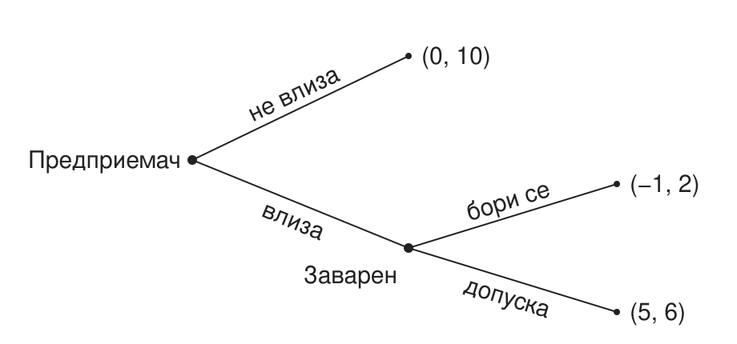
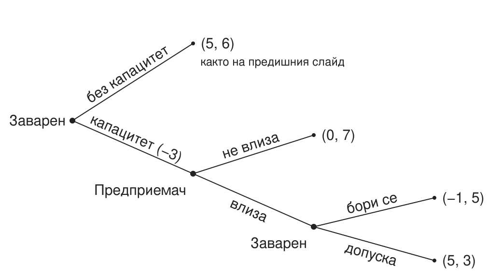

## Колко оцеляват? {#s03}

От 100 нови фирми в България колко са живи след пет години?

## План на лекцията {#s04}

1. Кой е предприемачът?
2. Къде отива талантът?
3. Струва ли си да се навлезе на един пазар?
4. На кой пазар?
5. Какво ще направят заварените играчи?
6. Как новите участници все пак навлизат?
7. Защо трябва да се занимаваме с това?

# Кой е предприемачът?

## Три идеи за предприемачеството {#s05}

| Автор | Предприемачът | Печалбата |
|---|---|---|
| Шумпетер (1942) | иноватор, който въвежда нови комбинации и измества старите (creative destruction) | временна, докато иновацията не бъде копирана |
| Кирцнер (1973) | откривател на възможности, които другите пропускат | ценова разлика, която другите не са забелязали |
| Найт (1921) | носител на несигурност, която не може да се застрахова | възнаграждение за тази несигурност |

Baumol, Litan & Schramm (2007): предприемач е всеки, нов или съществуващ, който предлага нов продукт или услуга или въвежда по-евтин начин да произвежда и доставя съществуващите.

## Какъв тип е всеки? {#s06}

1. Шофьор в Bolt вечер след работа
2. Служител в банка, който създава нов продукт
3. Франчайз на верига кафенета
4. Основател на стартъп

Разграничения: по възможност или по необходимост; предприемач или предприемач в организацията; иновация или копиране.

# Къде отива талантът?

## Три вида предприемачество {#s07}

| Вид | Какво прави | Пример |
|---|---|---|
| Продуктивно | създава стойност | нов продукт, по-евтин процес |
| Непродуктивно | преразпределя стойност | лобиране, заобикаляне на правила |
| Разрушително | унищожава стойност, може да е незаконно | неморално, непродуктивно |

Талантът е общо взето константен. Правилата решават къде отива (Baumol 1990).

## Имперски Китай {#s08}

:::: {.columns}
::: {.column width="42%"}
В имперски Китай най-способните не отиват в бизнеса, а на изпитите за държавни чиновници.

Къде отиват най-способните у нас днес?
:::

::: {.column width="58%"}
{fig-alt="Картина на Цю Ин от около 1540 г.: тълпа кандидати в халати под навес пред стената, на която са закачени резултатите от имперските изпити; отпред чакат коне и слуги."}
:::
::::

## Продуктивно, непродуктивно или разрушително? {#s09}

Помислете за всеки случай.

1. Софтуерна компания, създадена в София и продадена на глобален инвеститор (Telerik)
2. Фирма, която печели почти всяка обществена поръчка в своята община
3. Консултант, който „оптимизира“ проекти по европейски програми
4. Телефонни измамници, които звънят на пенсионери
5. Браншова организация, която лобира за нов лиценз за дейността
6. Данъчен консултант, който помага на фирми законно да плащат по-малко данъци
7. Приложение, което сравнява цените в супермаркетите
8. Фирма, която купува патенти само за да съди производители

# Струва ли си да се навлезе на един пазар?

## Оцеляване и оборот на фирмите {#s14}

От фирмите, създадени в България през 2015 г., през 2020 г. са активни 43% (ЕС-27: 46%). Около 4 от 10 нови фирми оцеляват пет години, близо до средното за ЕС.

Новосъздадени и закрити фирми за година, % от активните:

|  | 2018 | 2019 | 2020 | 2021 | 2022 | 2023 |
|---|---|---|---|---|---|---|
| България | 23,0 | 24,0 | 23,7 | 18,3 | 18,3 | 18,7 |
| ЕС-27 | 16,8 | 18,1 | 16,1 | 18,6 | 18,9 | 19,0 |

::: aside
Източник: Eurostat, bd_9bd_sz_cl_r2 (до 2020 г.) и bd_size (от 2021 г.), бизнес икономика. От 2021 г. методологията е нова и данните преди и след това не са напълно съпоставими.
:::

## Доходи от предприемачество {#s15}

- Медианният предприемач печели по-малко, отколкото би печелил като нает (Hamilton 2000).
- Печалбите са крайно неравни: малцина печелят много.
- Buffett (1984): 225 млн. души хвърлят монета. След 20 рунда около 215 са познали всеки път, само по случайност, и пишат книги за историята си.

225 000 000 × (1/2)^20^ ≈ 215

## Кой става предприемач {#s16}

- Децата на предприемачи по-често стават предприемачи (Dunn & Holtz-Eakin 2000).
- Наследство или печалба от лотария повишават шанса да се стартира нов бизнес (Holtz-Eakin, Joulfaian & Rosen 1994; Lindh & Ohlsson 1996).
- Повечето основатели започват в бранша, в който вече са работили (Bhidé 2000).
- Успешните основатели имат по-високи резултати на тестове за способности и повече нарушени правила като тийнейджъри (Levine & Rubinstein 2017).

# На кой пазар?

## Граници на пазара {#s17}

Двете грешки на основателите: „целият пазар на храни е наш“ и „нямаме конкуренти“.

| Граница | Определя се от | Пример |
|---|---|---|
| Физическа | докъде стига стоката | електроенергия: пазарните зони и междусистемните връзки |
| Регулаторна | какво казва законът | лицензите за таксиметров превоз в София |
| Икономическа | какво клиентът смята за заместител | такситата в София (следващият слайд) |

## Такситата в София {#s18}

Кои от тях са на пазара на таксиметрови услуги в София?

- TaxiMe
- метро
- тротинетка под наем
- градски транспорт
- собствен автомобил

## Тест на хипотетичния монополист {#s19}

1. Започваме с най-тесния кандидат-пазар: капучиното в кафенетата около НБУ.
2. Представяме си един собственик на всички тях.
3. Може ли трайно да вдигне цената с 5–10% и да спечели?
4. Ако не може, защото клиентите преминават към заместители, разширяваме кандидат-пазара и повтаряме. Ако може, това е пазарът.

## Критична загуба {#s20}

Критичната загуба е делът клиенти, при чиято загуба повишението на цената престава да е изгодно:

КЗ = *X* / (*X* + *M*)

*X* е повишението на цената, а *M* е маржът: цената минус пределния разход, като дял от цената.

Пример: капучино в кафене до НБУ поскъпва от 3,00 € на 3,30 € (*X* = 10%) при марж *M* = 40%. Тогава КЗ = 10 / (10 + 40) = 20%. Ако очакваме да загубим 15% от клиентите, повишението е изгодно; при 25% не е.

Колкото по-голяма е разликата между приходи и разходи, толкова по-малко клиенти можеш да си позволиш да загубиш.

## FTC срещу Meta (2025) {#s21}

- FTC твърди, че пазарът е само Facebook, Instagram, Snapchat и MeWe. Съдът (ноември 2025) добавя TikTok и YouTube, следователно Meta не е монополист.
- При безплатен продукт „цената“ е качеството: повече реклами, по-малко поверителност. Потребителите плащат с време.
- Естествен експеримент: Индия забранява TikTok (2020) и времето във Facebook расте с над 60%, а в Instagram почти се удвоява.

Ако Instagram удвои рекламите, къде отиваш?

# Какво ще направят заварените играчи?

## Бариери за навлизане {#s23}

Вярно или невярно: „Български пощи“ има законов монопол. [Невярно.]{.fragment}

| Бариера | Пример |
|---|---|
| Икономии от мащаба | електропреносната мрежа (естествен монопол) |
| Невъзвратими разходи | рафинерия, телекомуникационна мрежа |
| Мрежови ефекти | Viber: там са всички |
| Регулация и лицензи | такситата; лобито за нов лиценз от случай 5 |
| Контрол върху ключов ресурс | рафинерия, пристанищен терминал |

## Лукойл: доминиращ, но не естествен монопол {#s24}

- КЗК: „Лукойл-България“ е лидер в търговията на едро с автомобилни горива с дял между 40% и 60%.
- Октомври 2025: санкции на САЩ. 14 ноември 2025: правителството назначава особен търговски управител.
- Веригата на горивата: внос на суров петрол, пристанищен терминал, рафинерия, складове, търговия на едро, бензиностанции. Готови горива могат да се внасят и направо до складовете.

Ако собственикът трябва да излезе, по-лесно ли е навлизането? Къде са тесните места?

::: fragment
Тесни места: пристанищният терминал, рафинерията и складовете.
:::

## Брой фирми и конкуренция {#s25}

Колко аптеки трябват на един малък град, за да паднат цените: 1, 2, 3 или 5 и повече?

::: fragment
Повечето промяна идва с втората и третата фирма. Следващите променят малко (Bresnahan & Reiss 1991).
:::

## Играта на навлизане {#s26}

Вие сте заварен играч. Новият вече е влязъл. Борите ли се за запазване на пазарния дял или допускате навлизане на нов участник?

:::: {.columns}
::: {.column width="62%"}
{fig-alt="Дърво на играта. Предприемачът избира дали да влезе. Ако не влезе, печалбите са 0 за него и 10 за заварения. Ако влезе, завареният избира: борба дава −1 и 2, допускане дава 5 и 6."}
:::

::: {.column width="38%"}
Печалби: (предприемач, заварен).

::: {.incremental}
1. Завареният сравнява 2 и 6 и допуска.
2. Предприемачът сравнява 0 и 5 и влиза.
:::

::: fragment
Заплахата не е достоверна.
:::
:::
::::

## Doomsday device {#s27 .smaller}

Преди новия играч завареният може да построи допълнителен капацитет на цена 3. Платен веднъж, той прави борбата евтина; ако стои неизползван, е чист разход.

:::: {.columns}
::: {.column width="62%"}
{fig-alt="Дърво на играта с ангажимент. Завареният първо избира дали да построи капацитет за 3. Без капацитет изходът е като на предишния слайд: 5 и 6. С капацитет: ако новият не влезе, 0 и 7; ако влезе и завареният се бори, −1 и 5; ако допусне, 5 и 3."}
:::

::: {.column width="38%"}
::: {.incremental}
1. С капацитет борбата е по-изгодна (5 > 3): заплахата е достоверна.
2. Новият остава вън (0 > −1).
3. Завареният печели 7 вместо 6, затова строи.
4. Таен капацитет: новият влиза, завареният се бори и получава 5, по-малко, отколкото без капацитет.
:::

::: fragment
Ангажиментът работи само ако е видим и необратим (Dixit 1980).
:::
:::
::::

## Парадоксът на веригата магазини {#s28}

- Верига магазини среща нов играч във всеки от 20 града, един след друг.
- Ако мислим отзад напред: в град 20 допусни, следователно и в 19… и така навсякъде (Selten 1978).
- Реалните заварени играчи се съпротивляват на навлизането отрано. Защо?

::: fragment
Ако новите не знаят със сигурност дали завареният е склонен да се бори, борбата в първите градове му създава репутация, която възпира следващите (Kreps & Wilson 1982; Milgrom & Roberts 1982).
:::

## Задържане на клиенти {#s30}

- Договори за 24 месеца; регулаторът сваля тази бариера с преносимостта на номера.
- Приложения за лоялност на веригите.
- Viber: оставаш, защото всички са там.
- Google плаща, за да е търсачката по подразбиране (САЩ срещу Google, 2024).

При смяна на телефон (от iOS към Android или обратно), банка и мобилен оператор кое ще ти струва най-много: пари, време, данни или приятели?

# Как новите участници все пак навлизат?

## Стратегии за навлизане {#s31}

| Стратегия | Как | Пример |
|---|---|---|
| Остани малък | влез толкова малък, че да не си струва да те атакуват („джудо икономика“) | нискотарифни авиолинии |
| Заобиколи | не се бори там, където завареният е силен | TikTok не се бори с мрежата от приятели на Facebook; Revolut влиза с един продукт и европейска локация |
| Сътрудничи | лиценз, партньорство или продажба на заварения играч | Telerik, продадена на Progress (2014) |

::: aside
„Джудо икономика“: Gelman & Salop (1983).
:::

## Компасът на предприемаческата стратегия {#s32}

|  | Конкурирай се със заварените | Сътрудничи със заварените |
|---|---|---|
| Контролирай идеята | архитектурна стратегия | интелектуална собственост |
| Изпълнявай бързо | разрушителна иновация | верига на стойността |

::: aside
По Gans, Scott & Stern (2018).
:::

# Защо трябва да се занимаваме с това?

## Бариери и производителност {#s33}

- В търговията на дребно в САЩ през 90-те почти целият ръст на производителността идва от нови, по-производителни обекти, които изместват излизащите (Foster, Haltiwanger & Krizan 2006).
- У нас веригите изместиха кварталните магазини. Това е по-производително, но днес спорът е за пазарна сила.

Бариерите за навлизане пазят печалбите на заварените играчи и заедно с тях ниската им производителност.

## Накрая {#s34}

През 2025 г. бюджетната комисия на парламента одобри идея за държавна верига магазини само с български продукти и надценка до 10%.

1. Би ли дисциплинирала цените?
2. На кои бариери от днешната лекция ще се натъкне?

## Източници {#s35}

::: {.refs}
Baumol, W. J. (1990). Entrepreneurship: Productive, Unproductive, and Destructive. *Journal of Political Economy*.

Baumol, W. J., Litan, R. E. & Schramm, C. J. (2007). *Good Capitalism, Bad Capitalism*. Yale University Press.

Bhidé, A. (2000). *The Origin and Evolution of New Businesses*. Oxford University Press.

Bresnahan, T. & Reiss, P. (1991). Entry and Competition in Concentrated Markets. *Journal of Political Economy*.

Buffett, W. (1984). The Superinvestors of Graham-and-Doddsville. *Hermes*, Columbia Business School.

Dixit, A. (1980). The Role of Investment in Entry-Deterrence. *Economic Journal*.

Dunn, T. & Holtz-Eakin, D. (2000). Financial Capital, Human Capital, and the Transition to Self-Employment. *Journal of Labor Economics*.

Foster, L., Haltiwanger, J. & Krizan, C. J. (2006). Market Selection, Reallocation, and Restructuring in the U.S. Retail Trade Sector in the 1990s. *Review of Economics and Statistics*.

Gans, J., Scott, E. & Stern, S. (2018). Strategy for Start-Ups. *Harvard Business Review*.

Gelman, J. & Salop, S. (1983). Judo Economics: Capacity Limitation and Coupon Competition. *Bell Journal of Economics*.

Hamilton, B. (2000). Does Entrepreneurship Pay? *Journal of Political Economy*.

Holtz-Eakin, D., Joulfaian, D. & Rosen, H. (1994). Entrepreneurial Decisions and Liquidity Constraints. *RAND Journal of Economics*.

Kirzner, I. (1973). *Competition and Entrepreneurship*.

Knight, F. (1921). *Risk, Uncertainty and Profit*.

Kreps, D. & Wilson, R. (1982). Reputation and Imperfect Information. *Journal of Economic Theory*.

Levine, R. & Rubinstein, Y. (2017). Smart and Illicit: Who Becomes an Entrepreneur and Do They Earn More? *Quarterly Journal of Economics*.

Lindh, T. & Ohlsson, H. (1996). Self-Employment and Windfall Gains: Evidence from the Swedish Lottery. *Economic Journal*.

Milgrom, P. & Roberts, J. (1982). Predation, Reputation, and Entry Deterrence. *Journal of Economic Theory*.

Schumpeter, J. (1942). *Capitalism, Socialism and Democracy*.

Selten, R. (1978). The Chain Store Paradox. *Theory and Decision*.
:::

::: aside
Данни: Eurostat, bd_9bd_sz_cl_r2 и bd_size. Новини: БТА, Skadden, PPC Land, ESM Magazine. Изображение: Цю Ин, „Имперските изпити“ (ок. 1540), обществено достояние, Wikimedia Commons.
:::
